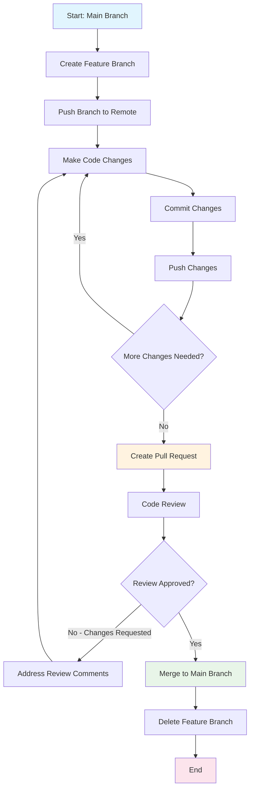

# GitHub Development Workflow

## Overview
This document outlines our standard GitHub development workflow using a feature branch approach with iterative development cycles.

## Workflow Description
Our development process follows these key steps:
1. **Create branch** - Start from main branch and create a feature branch
2. **Push branch** - Push the new branch to remote repository
3. **Iterative development cycle:**
   - Make code changes
   - Commit changes
   - Push changes
   - Repeat until feature is complete
4. **Create pull request** - Submit work for review when ready

## Workflow Diagram

